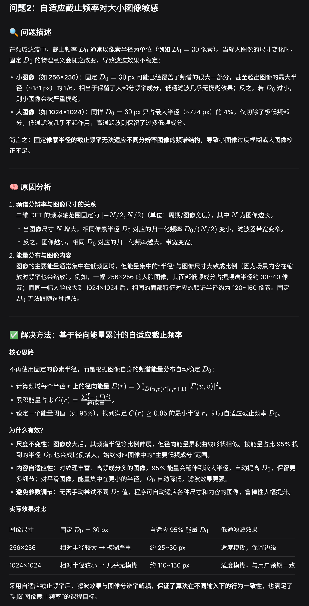
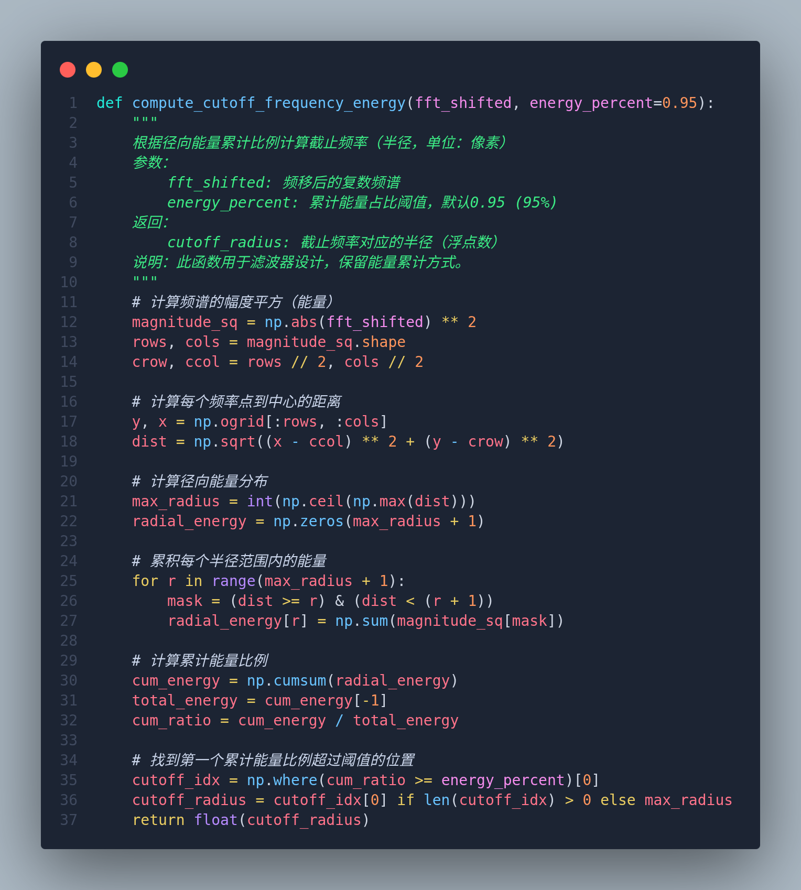

# 信号与系统课设

## 要求

### 分工要求

- 理论建模：刘越
- 仿真编程：刘越、杨潇羽
- PPT/文档：
- 现场汇报（可兼任）：

### PPT制作要求

**页数**：10–12页，按以下顺序：

| 页码 |              内容              |
| :--: | :----------------------------: |
|  1  |       选题 + 组员分工表       |
|  2  |   问题建模（系统框图/方程）   |
|  3  | 理论方法（标注所用课程知识点） |
| 4-5 | 核心仿真结果（波形/频谱/图像） |
|  6  |         扩展/对比结果         |
|  7  |      遇到的问题与解决方法      |
|  8  |         总结与改进方向         |
|  9  |            详细分工            |
|  10  |          代码结构说明          |

**硬性要求**：

- 每页不超过6行要点
- 必须包含至少2张图
- 最后一页放1个待讨论的问题

### 最终提交物

|    提交物    |      格式      |   截止时间   |
| :----------: | :-------------: | :-----------: |
|  代码与数据  |     `.py`     | `2026.5.28` |
| 课程设计报告 |     `PDF`     | `2026.5.28` |
|   汇报PPT   | 源文件 +`PDF` | `2026.5.28` |

---

## 评分标准（百分制）

### 细分项

|    评分项    |  分值  |
| :----------: | :----: |
|  建模正确性  | `20` |
| 课程方法运用 | `25` |
|  仿真与结果  | `20` |
|  扩展/对比  | `15` |
|  PPT与表达  | `10` |
|   分工合理   | `5` |
|   随机提问   | `5` |

### 随机提问规则

每组汇报结束后，教师随机点该组1名成员回答问题。答不出，该组扣5分；答出，该组得5分

### **扣分项**

- 超时 → `-5`分
- 无分工页 → `-5`分
- 无扩展项 → `-10`分

### 课堂互动加分（附加分，上限 `5`分）

- 在其他组汇报后的 `待讨论问题`环节，主动回答问题或提出有价值的追问，该生所在组加 `1`分/次
- 每组累计加分不超过 `5`分

---

## 题目：灰度图像频域处理

### 目的

正确理解二维傅里叶变换及滤波的基本概念，掌握低通、高通滤波器

### 必做内容

提供给学生几幅灰度图像（[图片路径](/img)，[下载地址](http://pan.baidu.com/s/1eQ7TXo2)）

1. 将图像数据变换到二维频域，判断该图像的截止频率；在频域进行低通滤波和高通滤波，恢复空域结果，比较滤波前后的图像差异
2. 设计一个差分滤波器，得到对该图像的二维一阶差分结果

### 扩展选项（三选一）

1. 对比理想低通、巴特沃斯低通、高斯低通的振铃效应
2. 实现同态滤波（`Homomorphic Filtering`）进行光照校正
3. 将频域高通滤波与 `Sobel`边缘检测结果对比

------

## 任务实现

### 任务一：灰度图像频域变换与滤波

1. [问题建模与理论方法](html/task1_freq_filter.html.html)

2. [程序实现](py/task1_freq_filter.py)

3. [效果预览](py/output/frequency_filtering_result.png)

4. 代码结构说明

   **模块与函数**

   - `load_grayscale_image`：加载灰度图像，转为 float32
   - `compute_fft_spectrum`：计算二维 FFT，返回频移频谱和对数幅度
   - `compute_cutoff_frequency_energy`：基于径向能量累计 95% 计算截止频率（用于滤波器设计）
   - `compute_cutoff_frequency_3db`：基于 -3dB 定义计算截止频率（仅用于显示）
   - `gaussian_lowpass_filter` / `gaussian_highpass_filter`：生成高斯低通/高通滤波器
   - `apply_filter_and_reconstruct`：频域滤波 + IFFT 重建，自动归一化
   - `visualize_log_spectrum`：将对数幅度谱映射到 0-255 显示
   - `main`：主流程，生成流程图式组合图，保存 PNG

   **处理流程**

   1. 读入图像 → FFT 得到频谱
   2. 计算 D0_filter（能量 95%）和 D0_display（-3dB）
   3. 构造高斯低通/高通滤波器（使用 D0_filter）
   4. 应用滤波得到低通/高通结果及对应的对数频谱
   5. 绘制 3×5 网格图：原图、原始频谱、低通频谱、低通结果、高通频谱、高通结果
   6. 添加箭头流程标注、截止频率显示（-3dB 值）
   7. 保存组合图 `frequency_filtering_result.png`

### 任务二：差分滤波器设计

1. [问题建模与理论方法](html/task2_diff_filter.html)

2. [程序实现](py/task2_diff_filter.py)

3. [效果预览](py/output/differential_filter_result.png)

4. 代码结构

   **模块与函数**

   - `load_grayscale_image`：加载灰度图像，转为 float32
   - `compute_fft_spectrum`：计算 FFT 并频移
   - `freq_differential_filters`：构造频域水平和垂直差分滤波器 H_x, H_y（基于傅里叶微分性质）
   - `apply_freq_filter`：频域滤波 + IFFT 返回实部
   - `magnitude_normalize`：归一化到 0-255
   - `visualize_filter_response`：计算水平差分滤波器的对数幅度响应并可视化
   - `main`：生成错位布局组合图

   **处理流程**

   1. 读入图像 → FFT
   2. 构造 H_x, H_y
   3. 分别应用 H_x, H_y 得到水平梯度 ∂f/∂x 和垂直梯度 ∂f/∂y
   4. 合成梯度幅值 |∇f|
   5. 生成滤波器响应热图（带 colorbar）
   6. 组合图布局：原图、水平梯度、垂直梯度、梯度幅值、滤波器响应（奥运五环式错位）
   7. 保存 `differential_filter_result.png`

### 扩展任务一：*对比理想低通、巴特沃斯低通、高斯低通的振铃效应*

1. [问题建模与理论方法](html/ext1_ringing.html)
2. [程序实现](py/ext1_ringing.py)
3. [效果预览](py/output/ringing_comparison.png)

### 扩展任务二：同态滤波光照校正 - 频域增强

1. [问题建模与理论方法](html/ext2_homomorphic.html)
2. [程序实现](ext2_homomorphic.py)
3. [效果预览](output/homomorphic_filtering_result.png)

### 扩展任务三：

#### 1. 频域高通滤波 vs `Sobel`边缘检测对比

1. [问题建模与理论方法](html/ext3_hpf_sobel_compare.html)

2. [程序实现](py/ext3_hpf_sobel_compare.py)

3. [效果预览](py/output/hpf_vs_sobel.png)

4. 代码结构：

   **模块与函数**

   - `load_grayscale_image`：加载灰度图像，转为 float32
   - `compute_cutoff_frequency`：基于径向能量累计 95% 计算自适应截止频率
   - `ideal_highpass_filter` / `gaussian_highpass_filter`：构造理想/高斯高通滤波器
   - `apply_filter_and_reconstruct`：频域滤波 + IFFT，取绝对值并归一化到 0-255
   - `sobel_edge_detection`：空域 Sobel 算子（ksize=3），计算梯度幅度并归一化
   - `normalize_display`：归一化到 0-255 用于显示
   - `main`：生成对比组合图

   **处理流程**

   1. 读入图像 → FFT 计算自适应截止频率 D0
   2. 根据 `--filter_type` 构造高通滤波器（理想或高斯），应用得到频域高通边缘图
   3. 计算 Sobel 梯度幅度图
   4. 生成 1 行 3 列布局：原图、频域高通结果、Sobel 结果
   5. 底部添加方法对比说明文本框
   6. 保存/显示`hpf_vs_sobel.png`

#### 2. `Sobel`核大小对比

1. [问题建模与理论方法](html/ext3_kernel_compare.html)

2. [代码实现](py/ext3_kernel_compare.py)

3. [效果预览](py/output/sobel_kernel_comparison.png)

4. 代码结构：

   **模块与函数**

   - `load_grayscale_image`：加载灰度图像，返回 uint8
   - `sobel_gradient_magnitude`：计算指定 ksize 的 Sobel 梯度幅度，自动归一化
   - `main`：生成对比组合图

   **处理流程**

   1. 读入图像
   2. 分别用 ksize=3, 7, 11 计算 Sobel 梯度幅度图
   3. 绘制 2×2 网格图：原图、ksize=3 结果、ksize=7 结果、ksize=11 结果
   4. 添加标题和说明文字，标注各核大小的特性
   5. 保存/显示 `sobel_kernel_comparison.png`

#### 3. Sobel vs Canny 边缘检测

1. [问题建模与理论方法](html/ext3_sobel_canny_compare.html)

2. [代码实现](py/ext3_sobel_canny_compare.py)

3. [效果预览](py/output/sobel_vs_canny.png)

4. 代码结构：

   ***模块与函数**

   - `load_grayscale_image`：加载灰度图像，转为 float32
   - `sobel_edge_detection`：Sobel 算子（ksize=3），梯度幅度归一化
   - `canny_edge_detection`：Canny 算子，支持自动阈值（中位数 ±33%）或用户指定
   - `normalize_display`：归一化到 0-255 用于显示
   - `main`：生成对比组合图

   **处理流程**

   1. 读入图像
   2. 计算 Sobel 梯度幅度图
   3. 计算 Canny 边缘图（自动或手动阈值）
   4. 生成 1 行 3 列布局：原图、Sobel 结果、Canny 结果
   5. 底部添加方法对比说明（Sobel 与 Canny 的优缺点）
   6. 保存/显示 `sobel_vs_canny.png`

------

## 遇到的问题与解决方法



设计了如下函数实现自适应截止频率计算



------

## 配置环境

1. 新建虚拟环境

   ```bash
   python3 -m venv .venv
   ```

   激活环境

   ```bash
   source .venv/bin/activate
   ```

2. 安装依赖

   ```bash
   pip install numpy matplotlib opencv-python scipy
   ```

   
