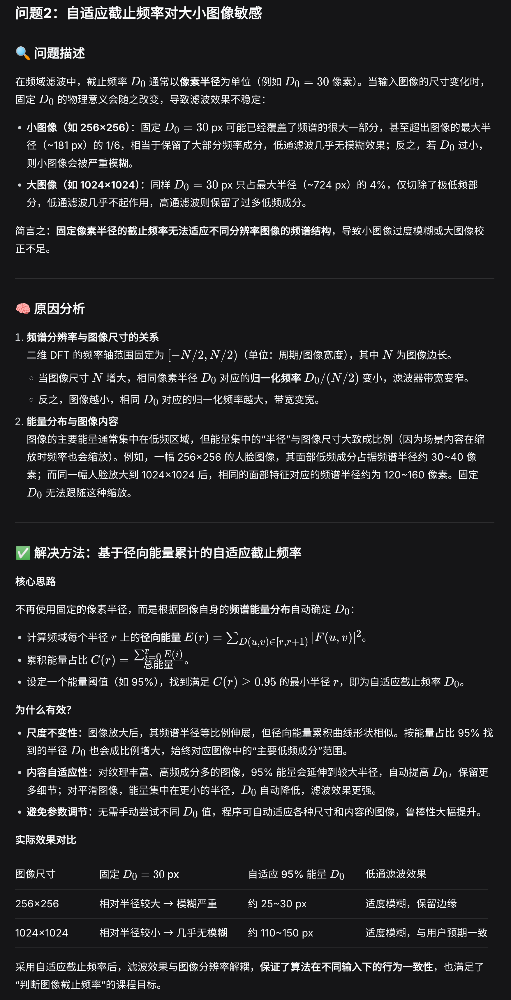
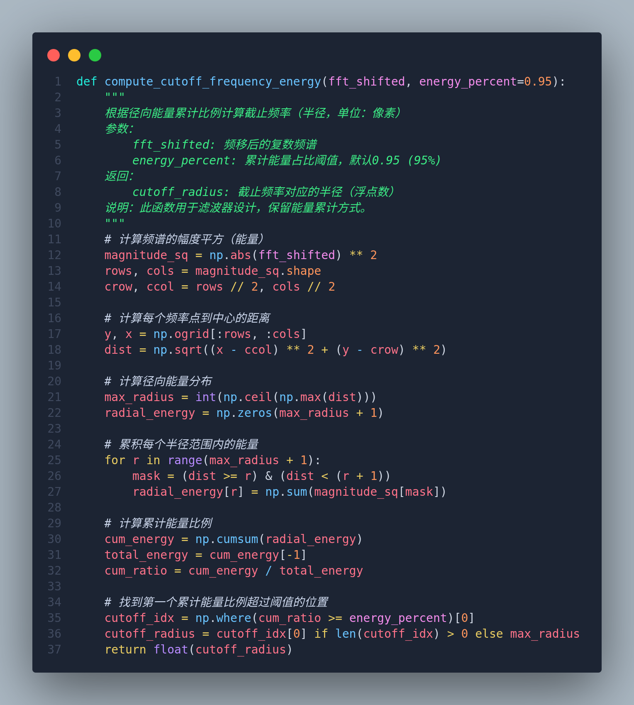
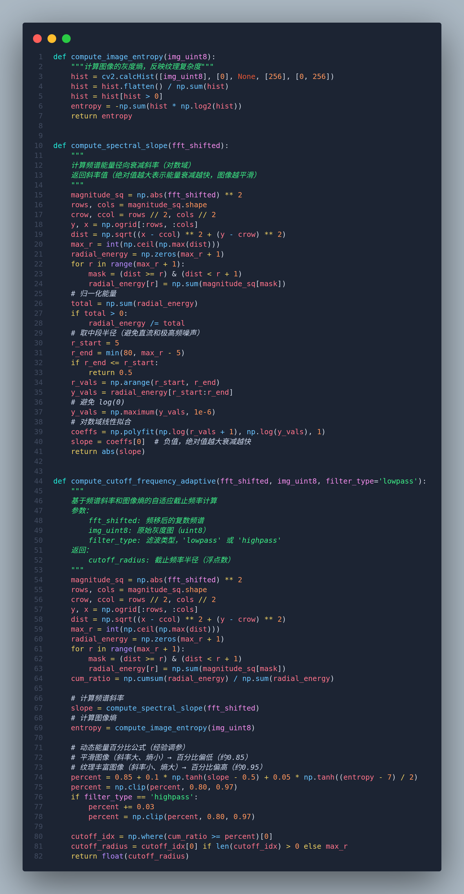

# 信号与系统课设

## 要求

### 分工要求

- 理论建模：刘越、骆易恺、熊胜利
- 仿真编程：刘越、杨潇羽、朱晨旭
- PPT/文档：刘越、杨潇羽、骆易恺、隆雨欣、熊胜利、朱晨旭
- 现场汇报（可兼任）：刘越、朱晨旭、骆易恺

### PPT制作要求

**页数**：10–12页，按以下顺序：

| 页码 |              内容              |
| :--: | :----------------------------: |
|  1  |       选题 + 组员分工表       |
|  2  |   问题建模（系统框图/方程）   |
|  3  | 理论方法（标注所用课程知识点） |
| 4-5 | 核心仿真结果（波形/频谱/图像） |
|  6  |         扩展/对比结果         |
|  7  |      遇到的问题与解决方法      |
|  8  |         总结与改进方向         |
|  9  |            详细分工            |
|  10  |          代码结构说明          |

**硬性要求**：

- 每页不超过6行要点
- 必须包含至少2张图
- 最后一页放1个待讨论的问题

### 报告制作要求

```
灰度图像频域处理实验报告
├─ 摘要
├─ 1 实验目的
├─ 2 实验问题建模（系统框图/方程）
│   ├─ 2.1 灰度图像频域变换
│   ├─ 2.2 差分滤波器设计
│   └─ 2.3 高通滤波和Sobel边缘检测
├─ 3 实验理论方法（课程知识点）
│   ├─ 3.1 灰度图像频域变换
│   ├─ 3.2 理想滤波与振铃效应
│   ├─ 3.3 高斯滤波
│   ├─ 3.4 差分滤波器
│   ├─ 3.5 Sobel边缘检测
│   └─ 3.6 Canny边缘检测（拓展）
├─ 4 实验代码实现和仿真结果分析
│   ├─ 4.1 灰度图像频域变换
│   │   ├─ 4.1.1 理想滤波（振铃效应明显）
│   │   └─ 4.1.2 高通滤波（振铃效应很弱）
│   ├─ 4.2 差分滤波器设计
│   └─ 4.3 边缘检测
│       ├─ 4.3.1 频域高通滤波 vs Sobel
│       ├─ 4.3.2 不同大小Sobel核对比
│       └─ 4.3.3 Sobel vs Canny
├─ 5 关于滤波器截止频率参数自适应选取
├─ 6 实验结论
└─ 7 实验心得
```

### 最终提交物

|    提交物    |      格式      |   截止时间   |
| :----------: | :-------------: | :-----------: |
|  代码与数据  |     `.py`     | `2026.5.28` |
| 课程设计报告 |     `PDF`     | `2026.5.28` |
|   汇报PPT   | 源文件 +`PDF` | `2026.5.28` |

---

## 评分标准（百分制）

### 细分项

|    评分项    |  分值  |
| :----------: | :----: |
|  建模正确性  | `20` |
| 课程方法运用 | `25` |
|  仿真与结果  | `20` |
|  扩展/对比  | `15` |
|  PPT与表达  | `10` |
|   分工合理   | `5` |
|   随机提问   | `5` |

### 随机提问规则

每组汇报结束后，教师随机点该组1名成员回答问题。答不出，该组扣5分；答出，该组得5分

### **扣分项**

- 超时 → `-5`分
- 无分工页 → `-5`分
- 无扩展项 → `-10`分

### 课堂互动加分（附加分，上限 `5`分）

- 在其他组汇报后的 `待讨论问题`环节，主动回答问题或提出有价值的追问，该生所在组加 `1`分/次
- 每组累计加分不超过 `5`分

---

## 题目：灰度图像频域处理

### 目的

正确理解二维傅里叶变换及滤波的基本概念，掌握低通、高通滤波器

### 必做内容

提供给学生几幅灰度图像（[图片路径](/img)，[下载地址](http://pan.baidu.com/s/1eQ7TXo2)）

1. 将图像数据变换到二维频域，判断该图像的截止频率；在频域进行低通滤波和高通滤波，恢复空域结果，比较滤波前后的图像差异
2. 设计一个差分滤波器，得到对该图像的二维一阶差分结果

### 扩展选项（三选一）

1. 对比理想低通、巴特沃斯低通、高斯低通的振铃效应
2. 实现同态滤波（`Homomorphic Filtering`）进行光照校正
3. 将频域高通滤波与 `Sobel`边缘检测结果对比

------

## 任务实现

### 任务一：灰度图像频域变换与滤波

#### 1. 理想滤波器

1. [问题建模与理论方法](html/task1_freq_filter.html)

2. [程序实现](py/task1_freq_ideal_filter.py)
   [程序实现2](py/task1_freq_gaussian_filter.py)

3. 效果预览

   

4. 代码结构说明

   **模块与函数**

   - `load_grayscale_image`：加载灰度图像，转为 float32
   - `compute_fft_spectrum`：计算 FFT，返回频移后频谱、对数幅度谱和线性幅度谱
   - `compute_image_entropy`：计算图像灰度熵，量化纹理复杂度
   - `compute_spectral_slope`：计算频谱能量径向衰减斜率（对数域），反映平滑程度
   - `compute_cutoff_frequency_adaptive`：基于频谱斜率和图像熵的自适应截止频率计算
   - `compute_cutoff_frequency_energy`：传统径向能量累计法（默认 95%）
   - `compute_cutoff_frequency_3db`：计算 -3dB 截止频率（仅用于显示）
   - `ideal_lowpass_filter` / `ideal_highpass_filter`：构造理想低通/高通滤波器
   - `apply_filter_and_reconstruct`：频域滤波 + IFFT，归一化到 0-255
   - `visualize_log_spectrum`：对数幅度谱归一化显示
   - `main`：主流程，生成流程图式组合图并保存
   
   **处理流程**
   
   1. 读入图像，转为灰度图
   2. 计算 FFT 和对数频谱
   3. 根据 `--cutoff_method` 选择自适应或能量累计法，确定滤波器设计用的截止频率 `D0_filter`
   4. 计算 -3dB 截止频率 `D0_display`（仅用于显示）
   5. 构造理想低通和高通滤波器（使用 `D0_filter`）
   6. 应用滤波，重建低通/高通图像及其对数频谱
   7. 绘制 3×5 网格图：原图、原始频谱、低通频谱、低通结果、高通频谱、高通结果，并添加箭头标注
   8. 标注显示的截止频率（-3dB 值）
   9. 保存 `frequency_ideal_filtering_result.png`，可选显示

#### 2. 高斯滤波器

1. [问题建模与理论方法](html/task1_ringing.html)

2. [程序实现](py/task1_freq_gaussian_filter.py)

3. 效果预览

   

4. 代码结构说明

   **模块与函数**

   - `load_grayscale_image`：加载灰度图像，转为 float32
   - `compute_fft_spectrum`：计算 FFT，返回频移后频谱、对数幅度谱和线性幅度谱
   - `compute_image_entropy`：计算图像灰度熵，量化纹理复杂度
   - `compute_spectral_slope`：计算频谱能量径向衰减斜率（对数域），反映平滑程度
   - `compute_cutoff_frequency_adaptive`：基于频谱斜率和图像熵的自适应截止频率计算
   - `compute_cutoff_frequency_energy`：传统径向能量累计法（默认 95%）
   - `compute_cutoff_frequency_3db`：计算 -3dB 截止频率（仅用于显示）
   - `gaussian_lowpass_filter` / `gaussian_highpass_filter`：构造高斯低通/高通滤波器
   - `apply_filter_and_reconstruct`：频域滤波 + IFFT，归一化到 0-255
   - `visualize_log_spectrum`：对数幅度谱归一化显示
   - `main`：主流程，生成流程图式组合图并保存

   **处理流程**

   1. 读入图像，转为灰度图
   2. 计算 FFT 和对数频谱
   3. 根据 `--cutoff_method` 选择自适应或能量累计法，确定滤波器设计用的截止频率 `D0_filter`
   4. 计算 -3dB 截止频率 `D0_display`（仅用于显示）
   5. 构造高斯低通和高通滤波器（使用 `D0_filter`）
   6. 应用滤波，重建低通/高通图像及其对数频谱
   7. 绘制 3×5 网格图：原图、原始频谱、低通频谱、低通结果、高通频谱、高通结果，并添加箭头标注
   8. 标注显示的截止频率（-3dB 值）
   9. 保存 `frequency_ideal_filtering_result.png`，可选显示

### 任务二：差分滤波器设计

1. [问题建模与理论方法](html/task2_diff_filter.html)

2. [程序实现](py/task2_diff_filter.py)

3. 效果预览

   

   

4. 代码结构

   **模块与函数**

   - `load_grayscale_image`：加载灰度图像，转为 float32
   - `compute_fft_spectrum`：计算 FFT 并频移
   - `freq_differential_filters`：构造频域水平和垂直差分滤波器 H_x, H_y（基于傅里叶微分性质）
   - `apply_freq_filter`：频域滤波 + IFFT 返回实部
   - `magnitude_normalize`：归一化到 0-255
   - `visualize_filter_response`：计算水平差分滤波器的对数幅度响应并可视化
   - `main`：生成错位布局组合图

   **处理流程**

   1. 读入图像 → FFT
   2. 构造 H_x, H_y
   3. 分别应用 H_x, H_y 得到水平梯度 ∂f/∂x 和垂直梯度 ∂f/∂y
   4. 合成梯度幅值 |∇f|
   5. 生成滤波器响应热图（带 colorbar）
   6. 组合图布局：原图、水平梯度、垂直梯度、梯度幅值、滤波器响应（奥运五环式错位）
   7. 保存 `differential_filter_result.png`

### 扩展任务A：*对比理想低通、巴特沃斯低通、高斯低通的振铃效应*

1. [问题建模与理论方法](html/ext1_ringing.html)
2. [程序实现](py/ext1_ringing.py)
3. [效果预览](py/output/ringing_comparison.png)

### 扩展任务B：同态滤波光照校正 - 频域增强

1. [问题建模与理论方法](html/ext2_homomorphic.html)
2. [程序实现](ext2_homomorphic.py)
3. [效果预览](output/homomorphic_filtering_result.png)

### 扩展任务C：

#### 1. 频域高通滤波 vs `Sobel`边缘检测对比

1. [问题建模与理论方法](html/ext3_hpf_sobel_compare.html)

2. [程序实现](py/ext3_hpf_sobel_compare.py)

3. 效果预览

   

4. 代码结构：

   **模块与函数**

   - `load_grayscale_image`：加载灰度图，转为 float32
   - `compute_image_entropy` / `compute_spectral_slope`：图像熵与频谱斜率
   - `compute_cutoff_frequency_adaptive` / `compute_cutoff_frequency_energy`：自适应/能量累计截止频率（用于高通）
   - `ideal_highpass_filter` / `gaussian_highpass_filter`：构造理想/高斯高通滤波器
   - `apply_filter_and_reconstruct`：频域滤波重建
   - `sobel_edge_detection`：Sobel 算子（ksize=3）计算梯度幅值
   - `normalize_display`：归一化显示
   - `main`：主流程，生成 2×2 对比图
   
   **处理流程**
   
   1. 加载图像
   2. 计算 FFT 及截止频率 `D0`（根据 `--cutoff_method`）
   3. 分别构造理想高通和高斯高通滤波器，应用得到 `img_hp_ideal` 和 `img_hp_gaussian`
   4. 计算 Sobel 梯度幅值图 `img_sobel`
   5. 绘制 2×2 网格图：原图、Sobel、理想高通结果、高斯高通结果
   6. 添加底部说明文字（对比总结）
   7. 保存 `hpf_vs_sobel.png`

#### 2. `Sobel`核大小对比

1. [问题建模与理论方法](html/ext3_kernel_compare.html)

2. [代码实现](py/ext3_kernel_compare.py)

3. 效果预览

   

4. 代码结构：

   **模块与函数**

   - `load_grayscale_image`：加载灰度图像，返回 uint8
   - `sobel_gradient_magnitude`：计算指定 ksize 的 Sobel 梯度幅度，使用 OpenCV 归一化
   - `main`：生成组合对比图

   **处理流程**

   1. 读入图像
   2. 分别用 ksize=3, 7, 11 调用 `sobel_gradient_magnitude`，得到 `sobel_3, sobel_7, sobel_11`
   3. 绘制 2×2 网格图：原图、ksize=3 结果、ksize=7 结果、ksize=11 结果
   4. 添加总标题及底部说明
   5. 保存 `sobel_kernel_comparison.png`

#### 3. Sobel vs Canny 边缘检测

1. [问题建模与理论方法](html/ext3_sobel_canny_compare.html)

2. [代码实现](py/ext3_sobel_canny_compare.py)

3. 效果预览

   

4. 代码结构：

   **模块与函数**

   - `load_grayscale_image`：加载灰度图，转为 float32
   - `sobel_edge_detection`：Sobel 梯度幅值（ksize=3）
   - `canny_edge_detection`：Canny 检测，支持自动阈值（基于梯度幅值直方图 Otsu，比例 0.4，回退中位数法）
   - `normalize_display`：归一化显示
   - `main`：主流程，生成 1×3 对比图

   **处理流程**

   1. 加载图像，转为 uint8
   2. 计算 Sobel 梯度幅值
   3. 调用 `canny_edge_detection` 获得二值边缘图（自动阈值或用户指定）
   4. 绘制 1×3 布局：原图、Sobel 结果、Canny 结果
   5. 添加底部说明文字
   6. 保存 `sobel_vs_canny.png`

------

## 遇到的问题与解决方法



设计了如下函数实现自适应截止频率计算

1. 基于能量累计比例

   

2. 基于频谱斜率+图像熵

   

------

## 待讨论问题

**频域差分滤波器虽然严格遵循傅里叶变换的微分性质，但对高频噪声极度敏感。在实际工程中，是否应该在差分前加入预平滑（如高斯滤波）？这种“平滑+差分”的组合与空域Sobel算子相比，在计算效率和抗噪性能上存在怎样的权衡？**

> 说明：频域差分滤波器无任何平滑作用，单像素噪声会被显著放大。Sobel算子内置加权平滑，对噪声有一定抑制。若在频域差分前对图像进行高斯预滤波，可降低噪声，但会模糊边缘。如何选择预平滑的参数（σ）以及是否值得从空域转到频域处理，是一个值得探讨的工程问题。

------

## 配置环境

1. 新建虚拟环境

   ```bash
   python3 -m venv .venv
   ```

   激活环境

   ```bash
   source .venv/bin/activate
   ```

2. 安装依赖

   ```bash
   pip install numpy matplotlib opencv-python scipy
   ```

   
