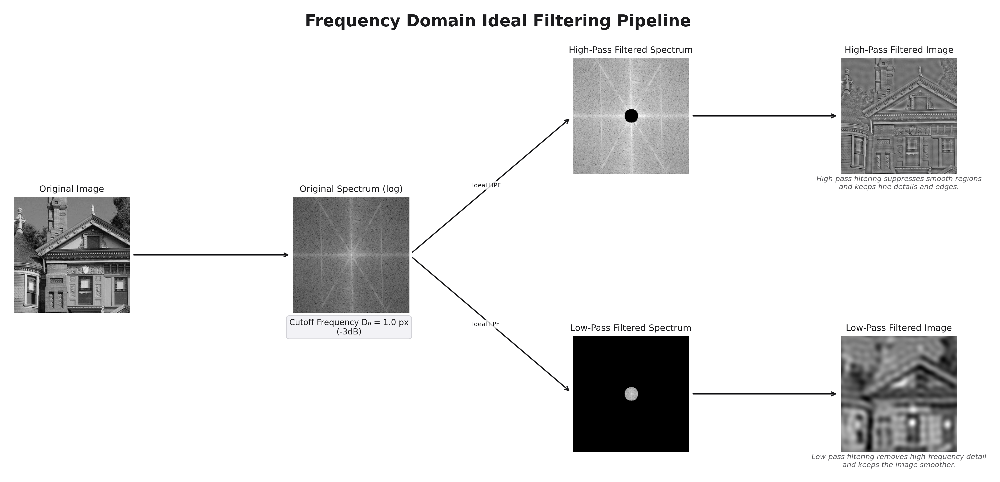
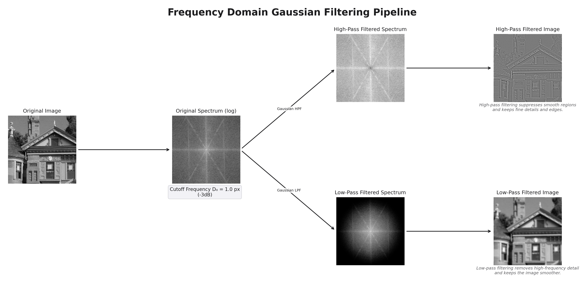
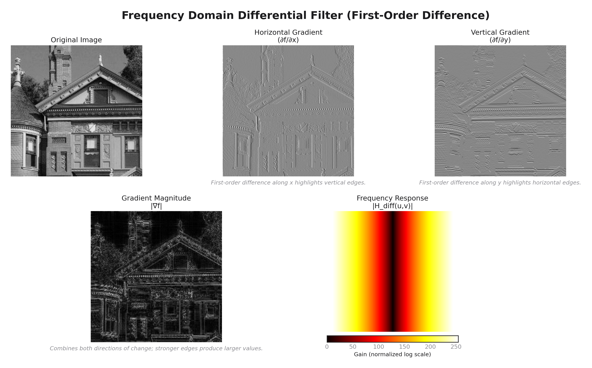
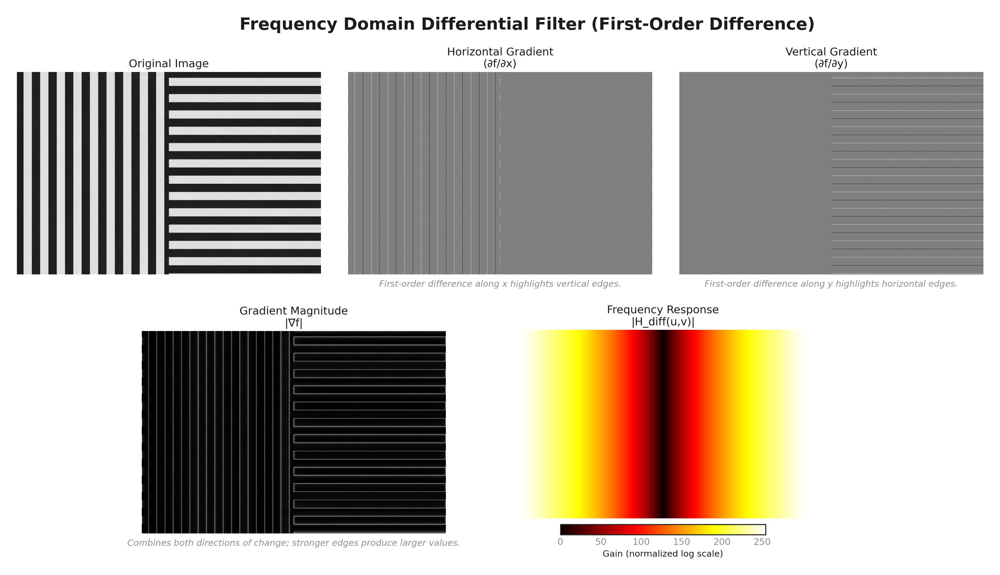
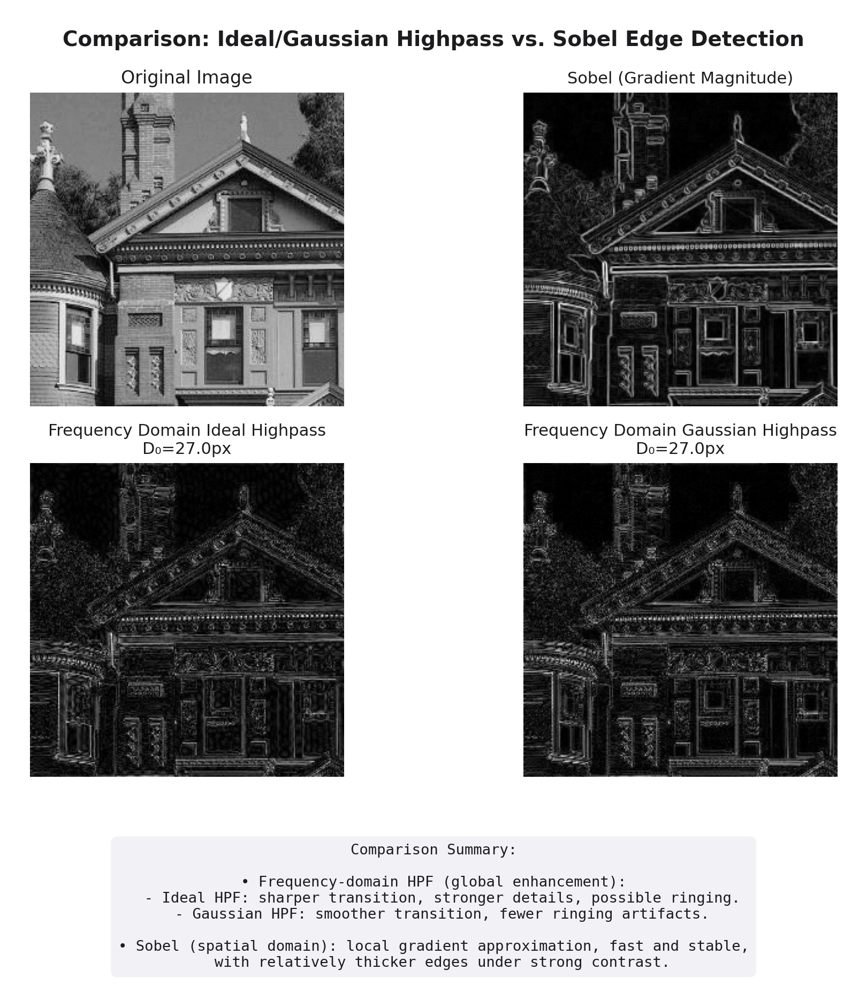
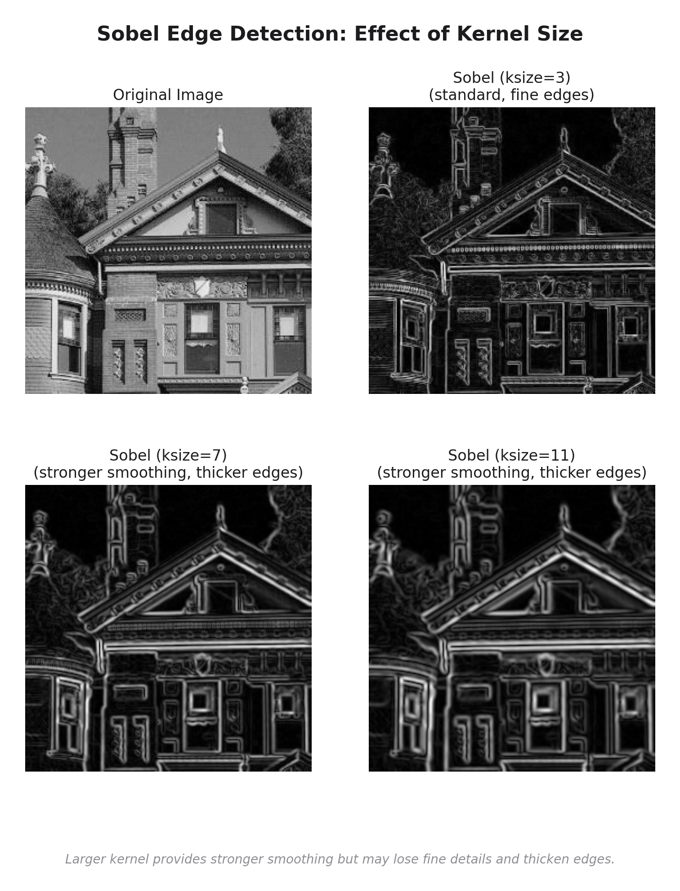
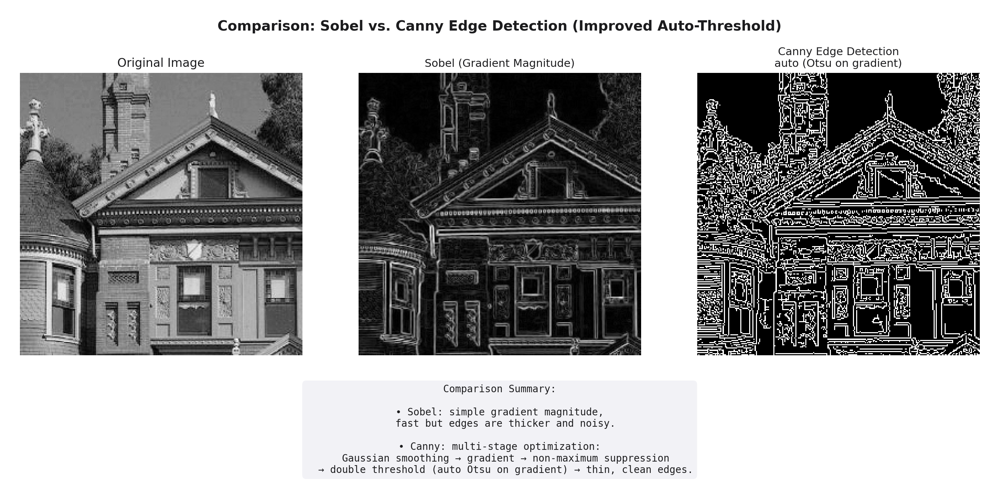

# 灰度图像频域处理实验报告

## 摘要

​	本实验以灰度图像 `house.bmp` 为对象，将图像看作二维离散信号，利用二维傅里叶变换把图像从空域变换到频域，观察频谱分布，并在频域中实现理想低通、理想高通和高斯型平滑滤波。实验进一步设计二维一阶差分滤波器，验证差分运算的方向选择性；同时将频域高通滤波与 Sobel 边缘检测进行对比，并补充 Sobel 核大小和 Canny 边缘检测的扩展分析。

​	报告按照“问题建模 — 理论方法 — 代码实现与结果分析 — 截止频率参数选取 — 结论与心得”的结构展开。实验结果表明，图像低频成分主要决定整体亮度和大尺度结构，高频成分主要对应边缘、纹理、细节和噪声。低通滤波可以平滑图像但会削弱边缘，高通和差分方法能够突出边缘，Sobel 与 Canny 则是在局部梯度和阈值筛选基础上的边缘检测方法。


**关键词**：二维傅里叶变换；频域滤波；理想滤波；高斯滤波；差分滤波；Sobel；Canny

---

## 1 实验目的

1.  理解灰度图像作为二维离散信号时，空域表示与频域表示之间的关系。
2.  掌握二维傅里叶变换 `fft2`、频谱中心化 `fftshift` 以及二维傅里叶反变换 `ifft2` 的基本流程。
3.  理解理想低通、理想高通和高斯滤波器的频率选择作用，并分析理想滤波可能产生的振铃效应。
4.  设计二维一阶差分滤波器，观察水平方向和垂直方向差分对边缘方向的选择性。
5.  对比频域高通滤波、Sobel 边缘检测和 Canny 边缘检测的结果，说明不同方法的适用场景。
6.  掌握根据频谱径向能量累计自适应选择截止频率的方法，避免固定半径对图像尺寸和内容的依赖。
7.  探究 Sobel 算子核大小（3、7、11）对边缘检测结果的影响，分析平滑性、边缘粗细与噪声抑制的权衡。

---

## 2 实验问题建模（系统框图/方程）

### 2.1 灰度图像频域变换

​	一幅灰度图像可以看作二维离散信号 \(f(x,y)\)，其中 \(x\) 和 \(y\) 表示像素坐标，\(f(x,y)\) 表示该点的灰度值。二维离散傅里叶变换（2D DFT）把图像分解到二维频率平面中，用 \(F(u,v)\) 表示各个空间频率成分的幅度和相位：

\[
F(u,v)=\sum_{x=0}^{M-1}\sum_{y=0}^{N-1} f(x,y)\,\exp\!\left(-j2\pi\left(\frac{ux}{M}+\frac{vy}{N}\right)\right)
\]

​	实际显示频谱时通常使用 `fftshift` 将低频移到频谱中心，再使用 \(\log(1+|F(u,v)|)\) 压缩动态范围，使频谱中较弱的高频纹理也能被观察到。整体处理链路可以写成：

\[
f(x,y) \xrightarrow{\text{FFT2}} \xrightarrow{\text{fftshift}} H(u,v)F(u,v) \xrightarrow{\text{ifftshift}} \xrightarrow{\text{IFFT2}} g(x,y)
\]

​	频域滤波的本质是逐点相乘：

\[
G(u,v)=H(u,v)\cdot F(u,v)
\]

### 2.2 差分滤波器设计

​	差分滤波器用于描述相邻像素灰度值的变化。若图像某处灰度变化剧烈，差分输出就较大，因此差分运算天然具有突出边缘和高频分量的作用。

水平一阶差分（前向差分）：
\[
\frac{\partial f}{\partial x} \approx f(x,y)-f(x-1,y)
\]

垂直一阶差分：
\[
\frac{\partial f}{\partial y} \approx f(x,y)-f(x,y-1)
\]

梯度幅值：
\[
|\nabla f(x,y)| = \sqrt{\left(\frac{\partial f}{\partial x}\right)^2 + \left(\frac{\partial f}{\partial y}\right)^2}
\]

基于傅里叶变换的微分性质，频域差分滤波器传递函数为：
\[
H_x(u,v)=j2\pi\frac{u}{M},\quad H_y(u,v)=j2\pi\frac{v}{N}
\]

其中 \(u,v\) 为频移后的离散频率坐标（范围 \(-M/2\sim M/2\)）。

### 2.3 高通滤波与 Sobel 边缘检测

**频域高通**：
\[
f(x,y)\xrightarrow{\text{FFT}} F(u,v)\xrightarrow{H_{\text{hp}}(u,v)} G(u,v)\xrightarrow{\text{IFFT}} g_{\text{hp}}(x,y)
\]

**空域 Sobel**：
\[
G_x = f * S_x,\quad G_y = f * S_y,\quad |G| = \sqrt{G_x^2+G_y^2}
\]

其中 Sobel 卷积核为：
\[
S_x = \begin{bmatrix}
-1 & 0 & 1 \\
-2 & 0 & 2 \\
-1 & 0 & 1
\end{bmatrix},\quad
S_y = \begin{bmatrix}
-1 & -2 & -1 \\
0 & 0 & 0 \\
1 & 2 & 1
\end{bmatrix}
\]

**Canny 边缘检测**：
\[
f(x,y)\xrightarrow{\text{高斯平滑}} f_s \xrightarrow{\text{梯度计算}} (M,\theta) \xrightarrow{\text{非极大值抑制}} \xrightarrow{\text{双阈值连接}} g_{\text{canny}}(x,y)
\]

---

## 3 实验理论方法（课程知识点）

### 3.1 灰度图像频域变换

​	本实验与《信号与系统》中的傅里叶变换思想一致。图像虽然是二维数据，但仍可以看作离散信号。频谱中心附近代表低频成分，主要对应图像整体亮度、大尺度结构和缓慢变化区域；远离中心的成分代表高频，主要对应边缘、纹理和细节。频谱的对称性（共轭对称）使得实信号的正负频率分量幅度相等。

### 3.2 理想滤波与振铃效应

​	理想低通或理想高通滤波器在频域中具有非常陡峭的截止边界，即频率响应从 1 突然跳变到 0。根据傅里叶变换关系，频域中的突变会对应空域中较长的振荡型冲激响应，常表现为空域图像边缘附近的波纹或过冲，这就是**振铃效应**。因此，理想滤波器概念清晰，便于说明低频和高频的作用，但在实际图像处理中并不一定是最自然的平滑方式。

​	理想低通滤波器传递函数：
\[
H_{\text{ilp}}(u,v) = \begin{cases}
1, & D(u,v) \le D_0 \\
0, & D(u,v) > D_0
\end{cases}
\]
其中 \(D(u,v)=\sqrt{(u-M/2)^2+(v-N/2)^2}\)。

​	理想高通滤波器：
\[
H_{\text{ihp}}(u,v) = 1 - H_{\text{ilp}}(u,v)
\]

### 3.3 高斯滤波

​	高斯滤波器的频率响应没有理想滤波那样突变，而是随频率平滑衰减。它可以抑制高频噪声，同时避免强烈的振铃效应。在图像处理中，高斯滤波常作为边缘检测前的预平滑步骤，例如 Canny 算法的第一步就是高斯平滑。

​	高斯低通滤波器：
\[
H_{\text{glp}}(u,v) = \exp\left(-\frac{D^2(u,v)}{2 D_0^2}\right)
\]
其中 \(D_0\) 相当于标准差。

​	高斯高通滤波器：
\[
H_{\text{ghp}}(u,v) = 1 - H_{\text{glp}}(u,v)
\]

​	高斯滤波器是线性相位滤波器，不会引入相位失真，且具有最优的时频局部化特性。

### 3.4 差分滤波器

​	一阶差分可以看作离散形式的微分。课堂中讲到，时域微分对应频域乘以频率变量；在图像中，空域差分也会增强高频成分。因此，差分滤波器能够突出灰度突变处，即边缘位置。相比于空域差分（如 \(f(x+1)-f(x-1)\)），频域差分直接乘以 \(j2\pi u\)，理论上实现了理想的一阶导数。但频域差分对高频噪声极度敏感，实际应用中常结合低通滤波（如 Sobel 中的平滑核）使用。

### 3.5 Sobel 边缘检测

​	Sobel 算子可理解为“局部平滑 + 一阶差分”的组合。它既计算水平和垂直方向的梯度，又通过 3×3 邻域中的加权项减弱单点噪声影响。其核可分解为平滑核与差分核的卷积：
\[
G_x = \mathbf{s}_y^T \cdot \mathbf{d}_x \qquad
G_y = \mathbf{d}_y^T \cdot \mathbf{s}_x
\]

$$
\text{ksize}=3 : \quad \mathbf{s} = \frac{1}{4}[1,2,1],\ \mathbf{d} = [-1,0,1] \\[4pt]
\text{ksize}=7 : \quad \mathbf{s} = \frac{1}{63}[1,2,3,3,3,2,1],\ \mathbf{d} = [-3,-2,-1,0,1,2,3]\\[4pt]
\text{ksize}=11 : \quad \mathbf{s} = \frac{1}{..}[1,2,3,4,5,5,5,4,3,2,1],\ \mathbf{d} =[-5,-4,-3,-2,-1,0,1,2,3,4,5]\\[4pt]
……
$$

增大核尺寸（如 7×7、11×11）相当于在更大邻域内进行平滑，因此对噪声的抑制能力增强，但边缘定位精度下降，边缘变粗。这一特性体现了边缘检测中的“不确定性原理”——定位精度与噪声鲁棒性不可兼得。

### 3.6 Canny 边缘检测（拓展）

​	Canny 算法基于三个最优准则：**信噪比准则**（不漏检真实边缘、不误检噪声）、**定位精度准则**（检测到的边缘尽可能接近真实中心）、**单边缘响应准则**（每个实际边缘只产生一个响应）。算法步骤：

1.  高斯平滑（参数 \(\sigma\) 控制尺度）；
2.  计算梯度幅值 \(M\) 和方向 \(\theta\)；
3.  非极大值抑制：沿梯度方向仅保留局部最大值，细化边缘；
4.  双阈值滞后连接：高阈值确定强边缘，低阈值连接弱边缘，形成连续轮廓。

相比 Sobel，Canny 输出的是二值、单像素宽的边缘，具有更好的抗噪性和连续性。

---

## 4 实验代码实现和仿真结果分析

### 4.1 灰度图像频域变换

​	本部分同时实现了**理想低通/高通滤波**和**高斯低通/高通滤波**，并对比了两种滤波器的效果。

#### 4.1.1 理想滤波（振铃效应明显）

​	理想低通滤波器在频域中采用圆形硬截止，边界由 1 突然变为 0。其空域等效冲激响应为 `sinc`函数，会出现振荡拖尾，因此在强边缘附近可能产生振铃或过冲。

​	**关键代码片段**（`task1_freq_filter.py`）：

```python
def ideal_lowpass_filter(shape, D0):
    """
    构造理想低通滤波器
    shape: (rows, cols)
    D0: 截止频率（像素半径）
    """
    rows, cols = shape
    crow, ccol = rows // 2, cols // 2
    u = np.arange(cols) - ccol
    v = np.arange(rows) - crow
    U, V = np.meshgrid(u, v)
    D = np.sqrt(U**2 + V**2)
    H_lp = np.zeros(shape, dtype=np.float32)
    H_lp[D <= D0] = 1.0
    return H_lp

def ideal_highpass_filter(shape, D0):
    """理想高通滤波器: H_hp = 1 - H_lp"""
    H_lp = ideal_lowpass_filter(shape, D0)
    return 1 - H_lp
```

应用滤波器并重建图像的通用函数：

```python
def apply_filter_and_reconstruct(fft_shifted, filter_h):
    filtered_fft = fft_shifted * filter_h
    f_ishift = np.fft.ifftshift(filtered_fft)
    img_reconstructed = np.fft.ifft2(f_ishift)
    img_reconstructed = np.real(img_reconstructed)
    # 归一化到 0-255
    img_min, img_max = img_reconstructed.min(), img_reconstructed.max()
    if img_max - img_min > 1e-8:
        img_norm = (img_reconstructed - img_min) / (img_max - img_min) * 255.0
    else:
        img_norm = np.zeros_like(img_reconstructed)
    return img_norm.astype(np.uint8)
```

**实验结果**：


图 1 灰度图像频域变换——理想滤波

**分析：**

​	理想低通滤波后恢复图像保留了房屋的大致轮廓，但窗框、屋顶线条等细节变得模糊，边缘附近出现轻微波纹（振铃）；理想高通滤波抑制中心低频后，平滑区域明显削弱，房屋轮廓、纹理和边缘更突出，但也会放大高频噪声。

#### 4.1.2 高斯滤波（无振铃效应）

​	高斯滤波器频域响应平滑，避免了陡峭截止，因此空域无振铃效应。

​	**关键代码片段**（`task1_freq_filter.py`）：

```python
def gaussian_lowpass_filter(shape, D0):
    rows, cols = shape
    crow, ccol = rows // 2, cols // 2
    u = np.arange(cols) - ccol
    v = np.arange(rows) - crow
    U, V = np.meshgrid(u, v)
    D2 = U**2 + V**2
    H_lp = np.exp(-D2 / (2 * (D0**2)))
    return H_lp

def gaussian_highpass_filter(shape, D0):
    H_lp = gaussian_lowpass_filter(shape, D0)
    return 1 - H_lp
```

**实验结果**：

 
图 2 灰度图像频域变换——高斯滤波

**分析：**

​	高斯低通滤波后图像显著平滑，细节模糊，但无明显振铃；高斯高通滤波后图像背景变暗，边缘轮廓清晰显现，平坦区域灰度被抑制，但无虚假波纹。

### 4.2 差分滤波器设计

​	基于傅里叶变换的微分性质，在频域构造水平差分滤波器 \(H_x\) 和垂直差分滤波器 \(H_y\)，分别与频谱相乘后逆变换得到水平梯度和垂直梯度，再合成梯度幅值图。同时可视化差分滤波器的频率响应（热力图）。

**关键代码片段**（`task2_diff_filter.py`）：

```python
def freq_differential_filters(shape):
    """
    构造频域差分滤波器（基于傅里叶变换微分性质）
    返回: H_x, H_y
    """
    rows, cols = shape
    crow, ccol = rows // 2, cols // 2
    u = np.arange(cols) - ccol
    v = np.arange(rows) - crow
    U, V = np.meshgrid(u, v)
    H_x = 1j * 2 * np.pi * U / cols
    H_y = 1j * 2 * np.pi * V / rows
    return H_x, H_y

def apply_freq_filter(fft_shifted, filter_h):
    filtered_fft = fft_shifted * filter_h
    f_ishift = np.fft.ifftshift(filtered_fft)
    result = np.fft.ifft2(f_ishift)
    return np.real(result)

# 主流程中的调用
fft_shifted = compute_fft_spectrum(img)
H_x, H_y = freq_differential_filters(img.shape)
grad_x_freq = apply_freq_filter(fft_shifted, H_x)   # ∂f/∂x
grad_y_freq = apply_freq_filter(fft_shifted, H_y)   # ∂f/∂y
grad_mag_freq = np.sqrt(grad_x_freq**2 + grad_y_freq**2)
```

**实验结果**：



图 4 `house.bmp`图像的一阶差分滤波结果

 
图 5 AI生成条纹图像验证差分方向选择性

**分析：**

​	水平梯度图中垂直边缘（如窗户竖框、房屋左右边界）响应强烈；垂直梯度图中水平边缘（如屋檐横线、屋顶轮廓）响应强烈；梯度幅值图综合所有方向，亮度越高表示局部对比度越强。条纹图像实验进一步验证了方向选择性：竖直条纹在水平差分中响应明显，水平条纹在垂直差分中响应明显。差分滤波器的频率响应显示增益随频率线性增加，与理论一致。

### 4.3 边缘检测

#### 4.3.1 频域高通滤波 vs Sobel

​	对比频域高通（理想/高斯）滤波结果与空域 Sobel 梯度幅值图。Sobel 采用默认核大小 3。

​	**关键代码片段**（`ext3_hpf_sobel_compare.py`）：

```python
def ideal_highpass_filter(shape, D0):
    rows, cols = shape
    crow, ccol = rows // 2, cols // 2
    u = np.arange(cols) - ccol
    v = np.arange(rows) - crow
    U, V = np.meshgrid(u, v)
    D = np.sqrt(U**2 + V**2)
    H = np.ones(shape, dtype=np.float32)
    H[D <= D0] = 0.0
    return H

def sobel_edge_detection(img_uint8):
    grad_x = cv2.Sobel(img_uint8, cv2.CV_32F, 1, 0, ksize=3)
    grad_y = cv2.Sobel(img_uint8, cv2.CV_32F, 0, 1, ksize=3)
    mag = np.sqrt(grad_x**2 + grad_y**2)
    mag_norm = (mag - mag.min()) / (mag.max() - mag.min() + 1e-8) * 255.0
    return mag_norm.astype(np.uint8)
```

**实验结果**：


 图 6 频域高通滤波与 Sobel 边缘检测对比

**对比分析**：

| 方法           | 处理方式     | 优点                     | 不足                     |
| -------------- | ------------ | ------------------------ | ------------------------ |
| 频域高通滤波   | 全局频率选择 | 整体增强高频细节         | 易同时增强噪声和细碎纹理 |
| Sobel 边缘检测 | 局部梯度计算 | 边缘结构较集中，计算简单 | 边缘较粗，仍会受噪声影响 |

#### 4.3.2 不同大小 Sobel 核对比

​	分别使用核大小 3、7、11 计算 Sobel 梯度幅值，观察平滑性、边缘粗细与噪声抑制的权衡。

**关键代码片段**（`ext3_kernel_compare.py`）：

```python
def sobel_gradient_magnitude(img_uint8, ksize):
    grad_x = cv2.Sobel(img_uint8, cv2.CV_32F, 1, 0, ksize=ksize)
    grad_y = cv2.Sobel(img_uint8, cv2.CV_32F, 0, 1, ksize=ksize)
    mag = np.sqrt(grad_x**2 + grad_y**2)
    mag_norm = cv2.normalize(mag, None, 0, 255, cv2.NORM_MINMAX)
    return mag_norm.astype(np.uint8)

# 调用
sobel_3 = sobel_gradient_magnitude(img, ksize=3)
sobel_7 = sobel_gradient_magnitude(img, ksize=7)
sobel_11 = sobel_gradient_magnitude(img, ksize=11)
```

**实验结果**：



图 7 不同 Sobel 核大小对比（ksize=3, 7, 11）

**分析**：

| Sobel 核大小 | 特点               | 结果表现                               |
| ------------ | ------------------ | -------------------------------------- |
| ksize=3      | 邻域小，定位精度高 | 细节丰富，但噪声和细碎纹理较明显       |
| ksize=7      | 平滑作用增强       | 噪声减少，主要边缘突出，边缘略粗       |
| ksize=11     | 平滑作用最强       | 主要边缘突出，但边缘较粗，细节损失更多 |

**结论**：核大小控制着平滑与定位的平衡，应根据图像噪声水平和精度要求选择。

#### 4.3.3 Sobel vs Canny

​	对比 Sobel 梯度幅值与 Canny 二值边缘图。Canny 采用自动阈值（基于中位数 ±33%）或手动指定阈值。

**关键代码片段**（`ext3_sobel_canny_compare.py`）：

```python
def canny_edge_detection(img_uint8, low_threshold=None, high_threshold=None):
    if low_threshold is None or high_threshold is None:
        sigma = 0.33
        v = np.median(img_uint8)
        low = int(max(0, (1.0 - sigma) * v))
        high = int(min(255, (1.0 + sigma) * v))
        edges = cv2.Canny(img_uint8, low, high)
    else:
        edges = cv2.Canny(img_uint8, low_threshold, high_threshold)
    return edges
```

**实验结果**：



图 8 Sobel 与 Canny 边缘检测对比

**分析**：

​	Sobel 输出灰度边缘强度，边缘较粗且存在多重响应（同一物理边缘附近有多个亮像素）；Canny 输出单像素宽、闭合、连续的边缘，视觉效果干净。Canny 的噪声抑制能力明显优于 Sobel。

---

## 5 关于滤波器截止频率参数选取的问题——自适应选取截止频率

​	频域滤波需要选择截止频率 \(D_0\)。若直接给定固定半径，例如 \(D_0=30\) 像素，则在不同的图像尺寸或内容下含义不一致，导致滤波强度不稳定。因此，本实验采用**径向能量累计法**自适应选取截止频率。

**算法步骤**：

1.  计算频移后频谱的幅度平方 \(|F(u,v)|^2\)；
2.  以频率中心为原点，统计每个半径 \(r\) 上的总能量 \(E(r)\)；
3.  计算能量累计比例 \(C(r) = \frac{\sum_{i=0}^{r} E(i)}{\sum_{i=0}^{R_{\max}} E(i)}\)；
4.  选取满足 \(C(r) \ge 0.95\) 的最小半径作为截止频率 \(D_0\)（保留 95% 的能量）。

**关键代码片段**（`task1_freq_filter.py`）：

```python
def compute_cutoff_frequency_energy(fft_shifted, energy_percent=0.95):
    magnitude_sq = np.abs(fft_shifted) ** 2
    rows, cols = magnitude_sq.shape
    crow, ccol = rows // 2, cols // 2
    y, x = np.ogrid[:rows, :cols]
    dist = np.sqrt((x - ccol)**2 + (y - crow)**2)
    max_radius = int(np.ceil(np.max(dist)))
    radial_energy = np.zeros(max_radius + 1)
    for r in range(max_radius + 1):
        mask = (dist >= r) & (dist < (r + 1))
        radial_energy[r] = np.sum(magnitude_sq[mask])
    cum_energy = np.cumsum(radial_energy)
    cum_ratio = cum_energy / cum_energy[-1]
    cutoff_idx = np.where(cum_ratio >= energy_percent)[0]
    return float(cutoff_idx[0]) if len(cutoff_idx) > 0 else float(max_radius)
```

**方法对比**：

| 方法         | 含义                       | 优点                           | 局限                           |
| ------------ | -------------------------- | ------------------------------ | ------------------------------ |
| 固定 \(D_0\) | 直接指定像素半径           | 实现简单，便于对比             | 对图像尺寸敏感，滤波强度不一致 |
| 径向能量累计 | 按能量累计比例自动确定半径 | 自适应图像内容与尺寸，结果稳定 | 需先计算频谱分布，计算量略高   |

采用自适应截止频率后，滤波器不再完全依赖人为经验，而是根据图像频谱自身的能量分布确定低频主成分范围，使低通滤波和高通滤波结果在不同图像上具有可比性，达到更好的滤波效果。

---

## 6 实验结论

1.  灰度图像可以看作二维离散信号，其频率组成可以通过二维傅里叶变换进行分析。频谱中心化后低频能量集中，高频对应边缘纹理。
2.  理想滤波器概念简单，但频率响应突变容易带来振铃效应；高斯滤波通过平滑过渡可以实现无振铃。
3.  低通滤波可以平滑图像但会削弱边缘和纹理；高通滤波可以增强边缘和细节，但也可能放大噪声。
4.  二维一阶差分滤波器本质上是一种高频增强方法，可以突出灰度变化剧烈的位置，并具有方向选择性。
5.  Sobel 算子通过局部梯度计算实现边缘检测，相比普通高通滤波，边缘结构更集中。核大小体现了边缘定位、噪声抑制和细节保留之间的折中：小核定位准但噪声敏感，大核抗噪强但边缘粗。
6.  Canny 算法通过多阶段筛选和细化（高斯平滑、非极大值抑制、双阈值连接）得到更清晰、单像素宽的边缘，但可能抑制部分弱纹理和弱边缘。
7.  自适应截止频率选取（能量累计 95%）可根据图像频谱自动确定滤波器参数，提高了算法的普适性。

---

## 7 实验心得

​	通过本次实验，我们小组更加直观地理解了频域分析的实际意义。图像虽然是二维数据，但与一维信号一样，也可以通过傅里叶变换分解为不同频率成分。频谱中心与远离中心区域分别对应低频和高频，这使得“低通平滑、高通增强边缘”的结论变得非常直观。

​	差分、Sobel 和 Canny 的对比也说明，边缘检测并不只是简单地“找线”。差分强调灰度变化，Sobel 在差分基础上加入局部平滑，Canny 又进一步进行边缘筛选和细化。不同方法之间没有绝对的好坏，而是适合不同任务：观察细节可用高通，快速观察梯度可用 Sobel，提取清晰轮廓可用 Canny。

​	代码实现过程中，我们小组掌握了 FFT 频移、径向能量统计、滤波器矩阵构造等技巧，并学习了如何利用 Matplotlib 绘制科学规范的多子图组合结果。特别值得一提的是，通过对比理想滤波和高斯滤波的实际输出，我们小组深刻理解了频域过渡带陡峭度对空域结果的重要影响——这正是课程中“频率响应与阶跃响应”关系的生动体现。

​	本实验把傅里叶变换、卷积定理、频率响应、差分系统和滤波器等课堂知识与实际图像结果联系起来，加深了对信号与系统方法的理解，也说明了同一套频域思想可以从一维信号推广到二维图像处理中。
